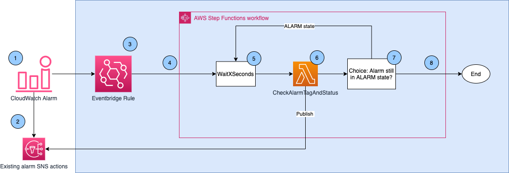
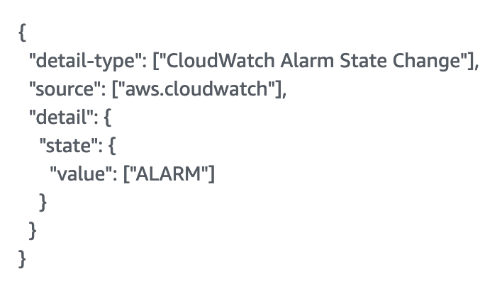
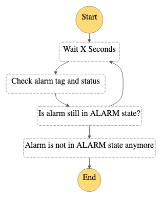
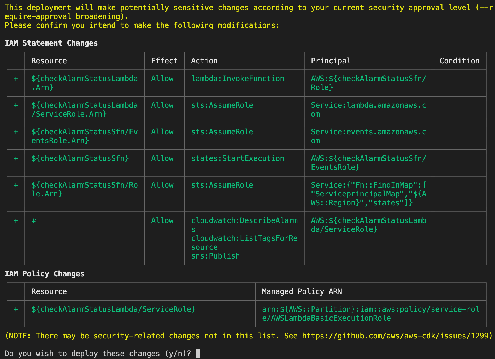
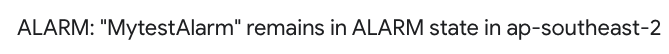
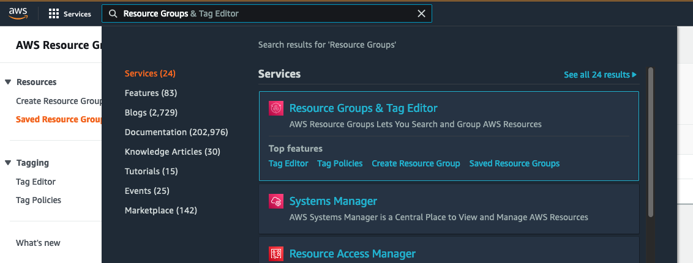
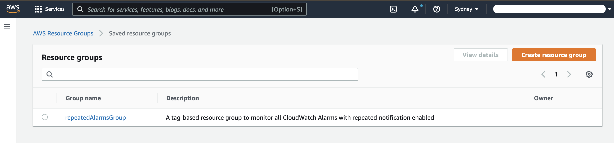
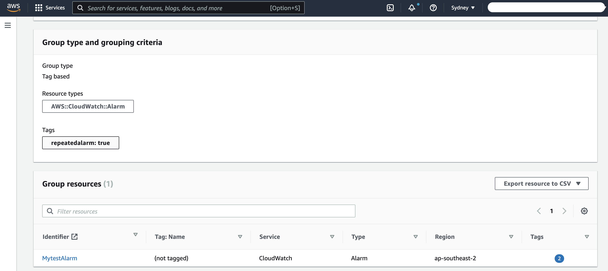
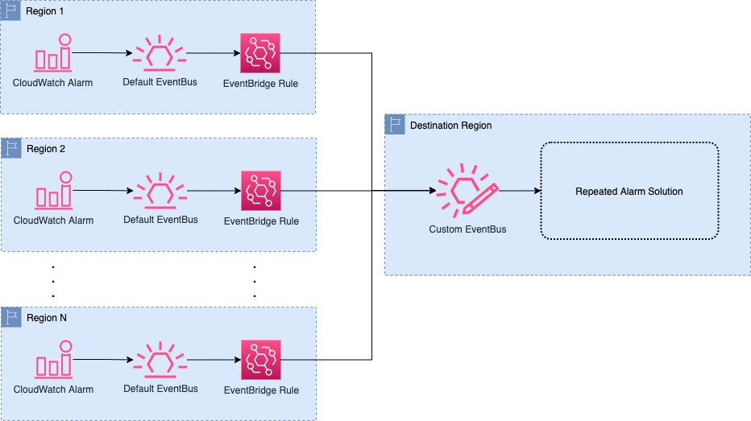

## How to Enable Amazon CloudWatch Alarms to Send Repeated Notifications

Amazon CloudWatch Alarms is natively integrated with Amazon CloudWatch metrics. Many AWS services send metrics to CloudWatch, and AWS also offers many approaches that let you emit your applications’ metrics as custom metrics. CloudWatch Alarms let you monitor the metrics changes when crossing a static threshold or falling out of an anomaly detection band. Furthermore, it lets you monitor the calculated result of multiple alarms. Then, CloudWatch Alarms automatically initiate actions when its state changes between OK, ALARM, and INSUFFICIENT_DATA. 

The most commonly used alarm action is to notify a person-of-interest or trigger downstream automation by sending a message to an Amazon Simple Notification Service (SNS) Topic. CloudWatch Alarms are designed to invoke only the alarm actions when a state change happens. The one exception is Autoscaling actions, where the scaling action will keep being invoked periodically when the alarm remains in the state that was configured for the action.

There are scenarios where you may find it useful to have repeated notifications on certain critical alarms so that the corresponding team is alerted to take actions promptly. In this post, I will show you how to use Amazon EventBridge, AWS Step Function, and AWS Lambda to enable repeated alarm notification on selected CloudWatch Alarms. I will also discuss the other customization use cases that can be achieved with alarm state change using the same solution model.

## Overview

Since 2019, Amazon EventBridge has integrated with Amazon CloudWatch so that when a CloudWatch alarm’s state changes, a corresponding [CloudWatch alarm state change event](https://docs.aws.amazon.com/AmazonCloudWatch/latest/monitoring/cloudwatch-and-eventbridge.html) is sent to the EventBridge service. You can create an EventBridge rule with customized rule pattern to capture

* all alarms’ stage change events，
* the alarms transitions to particular states，
* and state change events of alarms with certain prefixed names

Matched events mean that the rule invokes downstream automations to process the alarm’s state change event. This solution uses an AWS Step function to orchestrate repeated alarm notification workflow.

In this solution, we will enable repeated alarm notification by applying a specific tag on the CloudWatch alarm resources. Within the Step Function, a Lambda function can query the tags of the triggered alarm and only process further when the specific tag <key:value> is present. Moreover, this approach lets you create a centralized view of all of the alarms with repeated alarm notification enabled by creating a tag-based [resource group](https://docs.aws.amazon.com/ARG/latest/userguide/resource-groups.html#resource-groups-intro). The resource group is included as an optional part of this solution.

## Solution Architecture

This solution is deployed as an [AWS Cloud Development Kit (CDK)](https://aws.amazon.com/cdk/) application that deploys the resources highlighted within the blue rectangle in the following diagram to your AWS account. These resources are:

*	An EventBridge rule to capture all of the alarms’ state change events. 
*	A Lambda function to check the alarm’s tag, describe the alarm’s current state, and send notifications to existing SNS alarm actions on the alarm.
*	A Step Function state machine with a wait task, the above Lambda task, and a choice task.
*	Two IAM roles used for EventBridge to invoke the step function and for Lambda to perform the required actions respectively.
*	(Optional) A tag-based resource group including all of the CloudWatch alarms with the feature enablement tag.



This solution works as follows:

1.	CloudWatch alarm is triggered and goes into the ALARM state.
2.	CloudWatch alarm sends the first alarm notification to the associated SNS alarm actions.
3.	CloudWatch Alarms service sends an alarm state change event which triggers the EventBridge rule. The rule pattern used is shown as follows, which captures all of the alarms’ state changes to the ALARM event.



4.	With a match event, the EventBridge rule invokes the Step Function target
5.	Once the Step Function starts execution, it first enters a Wait state (“Wait X Seconds” in Figure 3). The wait period can be configured in the CDK application and passed to the state machine definition.
6.	Then it enters the Lambda Invocation task (“Check alarm tag and status” in Figure 3).
  * At this step, the Lambda function checks if the alarm has the specific tag key and value (e.g. RepeatedAlarm:true).
  * If not, stop Lambda invocation.
  * Otherwise, check the alarm’s current state by performing a DescribeAlarms API with the alarm name.
  * If the alarm is still in ALARM state, publish to all existing SNS topics on the alarm. The existing alarm actions are returned along with the alarm state within the same DescribeAlarms API call.
  * At last, return alarm’s current state together with the original received event back to Step Function
7.	The Choice state (“Is alarm still in ALARM state?” in Figure 3) then checks the alarm state returned by Lambda function and directs the workflow as below:
  * If alarm state is ALARM, go to Wait state again
  * Otherwise, the step function execution ends



With the above workflow, the repeated notification for an alarm stops when:
* Alarm transitions to non-ALARM state
* Alarm is deleted
* Specific tag is removed from the alarm

## Procedures

Now, let’s deploy the solution and see how it works.

### Pre-Requisites:
* AWS Account with AWS CLI access
* Node.js 10.13 or later
* AWS CDK
* Docker service (in running state when performing the following steps)

### Step 1: Deploy solution using AWS CDK

Before you can deploy a CDK application, make sure you have the AWS CDK CLI installed and AWS account bootstrapped as describe [here](https://docs.aws.amazon.com/cdk/latest/guide/getting_started.html). Then run the following command from your terminal to download the solution code and deploy.

```
git clone https://github.com/aws-samples/amazon-cloudwatch-alarms-repeated-notification-cdk.git
cd amazon-cloudwatch-alarms-repeated-notification-cdk
npm install
npm run build
cdk bootstrap #Required for first time CDK deployment
cdk deploy --parameters RepeatedNotificationPeriod=300 --parameters TagForRepeatedNotification=RepeatedAlarm:true --parameters RequireResourceGroup=false
```

With the “cdk deploy” command, you can also configure the following parameters:
* `RepeatedNotificationPeriod`: The time in seconds between 2 consecutive notifications from an alarm. The default is set to 300 in the CDK code.
* `TagForRepeatedNotification`: The tag used to enable repeated notification on an alarm. It must be in a key:value pair. The default for this parameter is RepeatedAlarm:true
* `RequireResourceGroup`: Whether to create a tag-based resource group to monitor all CloudWatch Alarms with repeated notification enabled. Allowed values: true/false.

### Step 2: Wait for the Deployment to Finish
Because this is a new deployment, you will see a summary of IAM resources to be created in the target account. These IAM resources are used by the components in the solution. No change is performed to any existing IAM resources in your account. You can review the change and accept by entering “y” to continue the deployment.



You will then see the progress of the deployment from your terminal. Wait for it to finish. You can also see the progress of the deployment from the CloudFormation.

### Step 3: Test the Solution

Once the deployment completes, you can test the solution on an alarm by applying the tag you used.

* Find a test alarm whose state is in ALARM state and has SNS alarm actions associated.
* Apply the tag on the selected alarm with the following AWS CLI command:

```
aws cloudwatch tag-resource --resource-arn arn:aws:cloudwatch:<region>:<account_id>:alarm:<alarm_name> --tags Key=RepeatedAlarm,Value=true
```

* Manually set the alarm state to OK by using the set-alarm-state CLI command.

```
aws cloudwatch set-alarm-state --alarm-name <alarm_name> --state-value OK --state-reason "test"
```

* Wait for the next alarm evaluation. For a standard alarm, it will re-evaluate within 1 min and transition to its actual state.
* Verify you receive ALARM notification every 5 mins. The repeated notification will have subject similar as below


### Step 4: View all alarms that have repeated notification enabled

AWS Resource Groups lets you search and group AWS resources based on tag. In this post, I will show you how to use this to have a centralized view of all alarms with repeated notification enabled.

* Go to Resource Groups & Tag Editor console

* If you select "true" for RequireResourceGroup when deploying cdk code, you shall see a tag-based resource named “repeatedAlarmsGroup”

* You can now view all alarms with repeated notification enabled


### Step 5: Disable repeated notification by untag the alarm

Run the below CLI command to untag the CloudWatch alarm. You should see the alarm disappear from the resource group created in the previous step as well.

```
aws cloudwatch untag-resource --resource-arn arn:aws:cloudwatch:<region>:<account_id>:alarm:<alarm_name> --tag-keys RepeatedAlarm
```


## Extended Reading

Since April 2021, Amazon EventBridge started to support cross-region event routing. With the launch of this new feature, you only just need to deploy this solution in one of the supported destination region to process repeated notification workflow across alarms in any commercial AWS Region. You can choose to deploy this solution to one of support destination region as listed here. The solution is shown in the below diagram.



With this framework, you can centralize alarm state change events from any commercial regions to a single supported region. This significantly reduces the operation overhead when it comes to resource management and troubleshooting.

In addition, this post mainly shows you how to use the native alarm state change event via Amazon EventBridge and AWS Step Function to enable repeated notification. However, the use of Amazon EventBridge to capture such event and orchestrate downstream workflow, also enables you to perform more advance alarm processing tasks by utilizing various [targets supported by Amazon EventBridge](https://docs.aws.amazon.com/eventbridge/latest/userguide/eb-targets.html#eb-console-targets). Example such as enrich/format/pretty-print the alarm message or execute playbooks with a Lambda Function target or SSM automation.

## Clean Up

To avoid additional infrastructure costs from the examples described in this posy, be sure to delete all resources created. You can simply clean up the resource by running the follow command:

```
cd amazon-cloudwatch-alarms-repeated-notification-cdk
cdk destroy
```

In addition, Lambda created in this solution will lead to a CloudWatch Log group with the prefix “/aws/lambda/RepeatedCloudWatchAlarm”. Please make sure to delete the log group to avoid CloudWatch Log storage charge.


## Conclusion

In this post, we’ve focused on how to enable repeated notification on CloudWatch Alarms by utilizing alarm state change event via Amazon EventBridge and AWS Step Function. With this solution, hopefully you will not miss any mission critical alarms and improve the response time of the incident. The same framework can also be extended to handle more advanced alarm processing tasks. Please share your feedback about the solution.


## Security

See [CONTRIBUTING](CONTRIBUTING.md#security-issue-notifications) for more information.

## License

This library is licensed under the MIT-0 License. See the LICENSE file.
